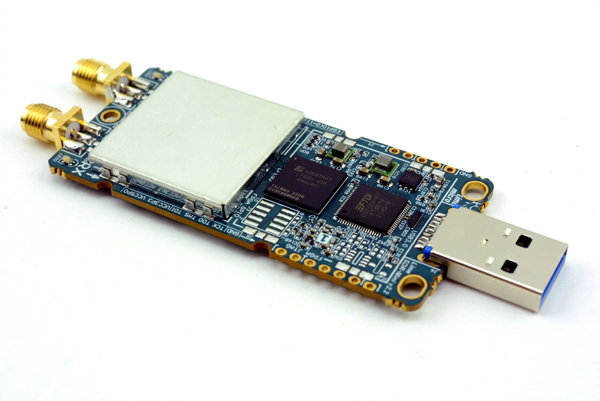

Introduction
############

.. toctree::
   :maxdepth: 2
   :hidden:

   Introduction <self>
   user/index
   reference/index
   developer

The LimeSDR Mini v2 is a compact and cost-effective software-defined radio (SDR) platform engineered for advanced wireless communication research, prototyping, and development. The device is based on the Lime Microsystems LMS7002M RF transceiver, supporting a frequency range of 10 MHz to 2.6 GHz, full-duplex operation, and instantaneous bandwidths of up to 30.72 MHz.

The digital processing architecture incorporates a Lattice ECP5 FPGA, which performs high-speed data handling, digital signal processing, and interface management between the RF front end and the host system. The FPGA enables flexible hardware-level customization, allowing implementation of user-defined processing pipelines and acceleration of computationally intensive tasks.

Connectivity is provided through a USB 3.0 interface, ensuring reliable high-throughput data transfer to a host computer. The platform is supported by established open-source software frameworks, including GNU Radio, `WSDR.IO <https://wsdr.io/>`_ and SoapySDR, facilitating integration into diverse development environments.

Specifications
**************

RF
==

.. list-table:: 
   :header-rows: 1
   :stub-columns: 1

   * - Parameter
     - Value
     - Notes
   * - Configuration
     - SISO (1T1R)
     - Full duplex
   * - Frequency Range
     - 10 MHz – 2.6 GHz
     - Non-continuous coverage
   * - Bandwidth
     - up to 30.72 MHz
     - Software configurable
   * - Sample depth
     - 12 bit
     - 
   * - Sample rate
     - 30.72 MSPS
     -
   * - Max. Safe Rx Input Power
     - 10 dBm
     - Absolute maximum
   * - Rx Gain Range
     - 89 dB
     - LNA + TIA + PGA combined

Digital Interface
=================

USB 3.0 Type-A plug connector.

Power Supply
============

.. list-table:: 
   :header-rows: 1
   :stub-columns: 1

   * - Parameter
     - Value
     - Notes
   * - Input Voltage
     - 5 V DC
     - Via USB Type-A connector
   * - Maximum Power
     - 4.5 W
     - USB 3.0 power limit

.. note::
   Power consumption depends on configuration.

.. warning::
   Incorrect voltage or inadequate current capacity may cause damage or unstable operation.

Environmental
=============

.. list-table:: 
   :header-rows: 1
   :stub-columns: 1

   * - Parameter
     - Value
     - Notes
   * - Operating Temperature
     - 0 °C to +70 °C
     - Commercial-grade
   * - Storage Temperature
     - 0 °C to +70 °C
     - N/A
   * - Operating Humidity
     - 10% to 90% RH  
     - Non-condensing

Mechanical
==========

Compact USB stick form factor, 69 × 31.4 mm, ~25g weight. (without enclosure)

Features
********

Devices
=======

* RF transceiver: Lime Microsystems LMS7002M
* FPGA: board is designed for Lattice ECP5 family LFE5U-25F/LFE5U-45F/LFE5U-85F FPGAs in 285-ball csfBGA package. By default board is assembled with LFE5U-45F-MG285 FPGA. Lattice ECP5 LFE5U-45F features:

  * 285-pin csfBGA package (10 x 10 mm, 0.5 mm)
  * 44 K LUTs logic capacity
  * 108 sysMEM Blocks (18 Kb)
  * 1944 Kb Embedded Memory
  * 351 Kb distributed RAM
  * 72x 18x18-bit multipliers
  * 4x PLLs and 4x DLLs
  * 118 IOs
  * FPGA configuration via JTAG
	
* USB 3.0 controller: FTDI FT601
* Temperature sensor: LM75

Clock system
============

* 40.00MHz on board VCTCXO
* VCTCXO can be tuned by onboard DAC
* Reference clock input and output connectors (U.FL)

Memory
======

* EEPROM Memory: 2x 128Kb EEPROMs for LMS MCU firmware and FPGA data (optional)
* FLASH Memory: 128Mb Flash memory for FPGA configuration

General user inputs/outputs:
============================

* 3x Dual colour (RG) LEDs
* 8x + 2x FPGA GPIO pinheaders (3.3V) (optional)

Connections
===========

* USB 3.0 (type A) plug
* Coaxial RF (SMA female) connectors
* FPGA GPIO headers (unpopulated)
* FPGA JTAG connector (unpopulated)
* FAN (5V default or 3.3V) connector

Purchasing
**********

Please see the  `Lime Micro website`_ for purchasing options.

RoHS
====

This product is RoHS compliant and does not contain hazardous substances as defined by Directive 2011/65/EU.

WEEE
====

This product must be disposed of properly according to local regulations. Do not dispose of with general household waste.

RF Transmission Notice
======================

.. warning::
   Operating RF transmitting equipment may require appropriate licensing. Users are responsible for ensuring compliance with local regulations. Unauthorised transmission may result in legal penalties.

.. _Lime Micro Website: https://limemicro.com/sdr/limesdr-mini-2-0/
